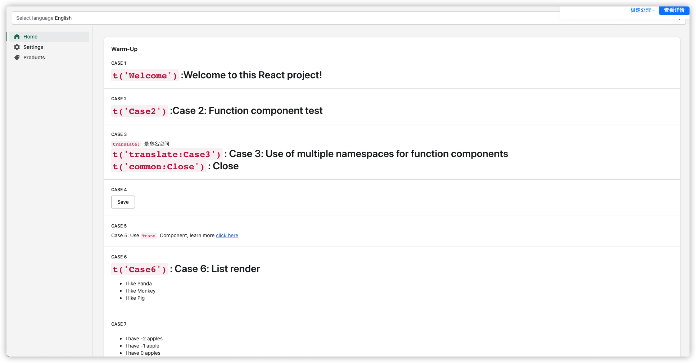

# react-i18next-base-usage

React + react-i18next 例子

## 使用到的技术栈

- React 17
- [Vite](https://cn.vitejs.dev/guide/) - 下一代前端开发与构建工具，极速启动服务
- [TypeScript](https://www.typescriptlang.org/zh/docs/) - JavaScript 的超集，拥有静态类型
- [Shopify Polaris](https://polaris.shopify.com/) - 前端样式框架
- [react-i18next](https://react.i18next.com/) - 基于 **i18next** 的一款强大的国际化框架
- [React Router V5](https://v5.reactrouter.com/) - 路由系统

## 安装

### 基础环境要求

> 以下是我测试通过的环境

- Node.js: `v17.6.0`
- Yarn: `1.22.17`

### 安装&使用

```shell
# 安装依赖包
yarn

# 启动开发环境(运行)
yarn run dev
```

## 运行截图



## 文档说明

[点击下载](./React_多语言之 react-i18next.pdf)
